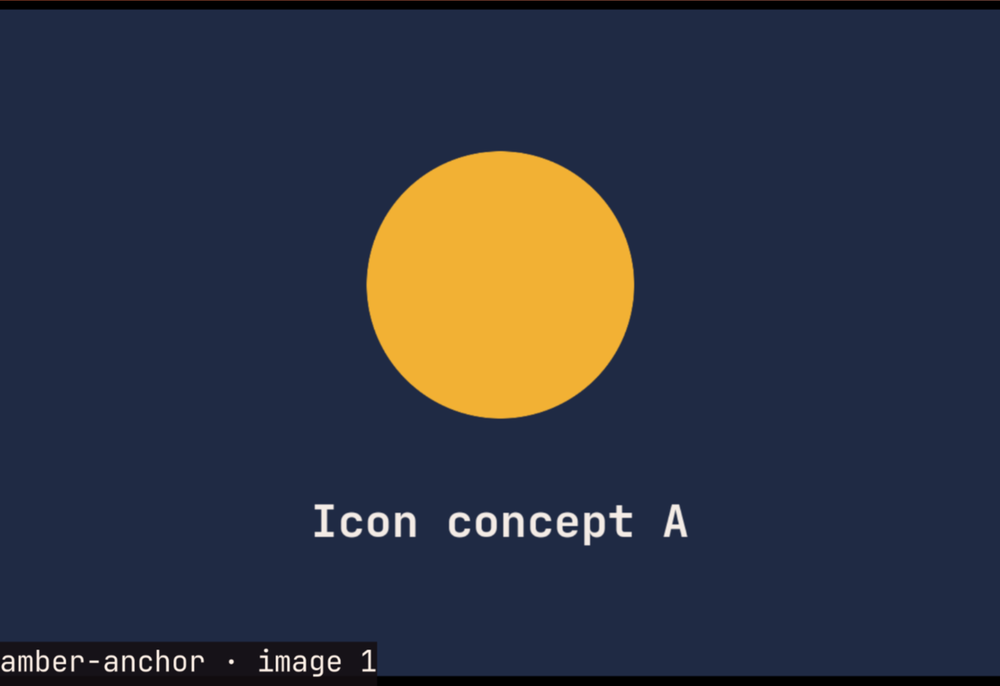

# Agent Gallery

One review queue for images made by your coding agents. When Claude Code,
Codex or any other agent has images for you to look at, it submits them here
instead of opening its own viewer window. You open the next set with one key,
whenever you're ready.



- **One queue for every agent.** Sets wait in order, so several agents can
  submit at once without windows popping up over your work.
- **Name what you mean.** Every image gets a short reference ID, such as
  `amber-anchor`, shown in the viewer. Tell the agent "go with amber-anchor"
  instead of "the third one". IDs never touch the image files.
- **Keyboard first.** Super+G opens the set; arrows (or `j`/`l`) browse; `q`
  closes it. The set stays until an agent submits the next one, so you can
  reopen it.
- **Side by side when it helps.** A set submitted with `--tile` opens tiled
  rather than floating, for half-screen comparisons such as colour palettes.

## Install

Needs [imv](https://sr.ht/~exec64/imv/), `jq`, `flock` and `file` (all
standard on [Omarchy](https://omarchy.org/); on Arch, `pacman -S imv jq`).
Tiled sets need Hyprland.

```bash
git clone https://github.com/benredrew/agent-gallery
cd agent-gallery
install -Dm755 agent-gallery ~/.local/bin/agent-gallery
install -Dm644 imv/config ~/.config/agent-gallery/imv/config
```

Then bind a key. On Omarchy, add [`hypr/bindings.lua`](hypr/bindings.lua) to
`~/.config/hypr/bindings.lua`. It uses Super+G, replacing Omarchy's
window-grouping toggle; choose another key if you use grouping. Any other
setup only needs a key that runs `agent-gallery view`.

## Use

```bash
agent-gallery submit "Icon concepts" ~/art/a.png ~/art/b.png ~/art/c.png
agent-gallery submit --tile "Palette comparison" light.png dark.png
agent-gallery view      # open the current set
agent-gallery status    # what's open and what's waiting
```

Agents do the submitting; you mostly just press Super+G.

## Teach your agents

[`AGENT-GALLERY.md`](AGENT-GALLERY.md) is a one-page guide for coding agents.
Put it somewhere they can read, and add a line to your global agent
instructions (`~/.claude/CLAUDE.md`, `~/.codex/AGENTS.md`):

```markdown
## Image review queue

When the user must review generated or edited images, submit the exact ordered
set to the shared Agent Gallery instead of opening a private viewer. Read
`~/.agents/AGENT-GALLERY.md` and use `agent-gallery submit ...`; the user opens
the next set with `SUPER + G`.
```

## How it works

Queued sets live in `~/.local/state/agent-gallery/`. Submitting copies only
the list of image paths, never the images, so a set shows the files as they
are when you open it. Once a newer set is waiting, the next `view` archives
the current one and opens the newer set.

## License

MIT. See `LICENSE`.
